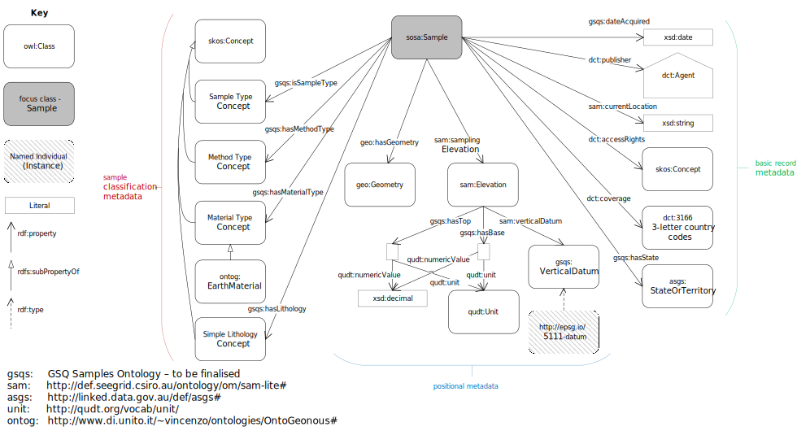
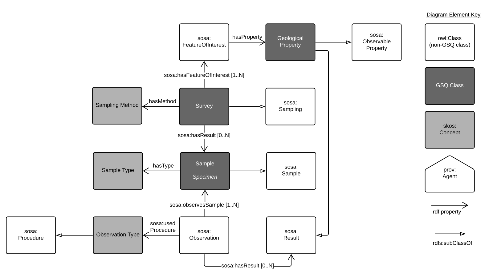

# GSQ Sample Profile

This is the Geological Survey of Queensland's *sample* model. The model, overviewed in Figure 1, derives its basic metadata from the requirements for describing samples according to the [International GeoSample Number (IGSN)](http://igsn.org) system and takes as its `Sample` class starting point the [SOSA Vocabulary's](https://www.w3.org/TR/vocab-ssn/) notion of a `Sample`.

  

**Figure 1**: This model's `Sample` class showing basic properties  

# Linking Sample to the Geological Property Model

The *Geological Property* is the basis of the understanding of the surface and subsurface of Queensland. The model, overviewed in Figure 2, derives its basic metadata from the [SOSA Vocabulary](https://www.w3.org/TR/vocab-ssn/).

1. A survey is a one-time event on a feature of interest that results in samples being collected.
2. Observations, using a procedure, are performed on the samples to yield results.
3. The results inform the geological properties for the feature of interest.

  

**Figure 2**: The survey > sample > geological property model  

# Geochemistry Product Model - high level

The *Geochemistry Product* is a *set* of geological observations, e.g. a compilation of all of the geochemistry data for a specific sub-block. The purpose of the *Geochemistry Product* is to create a distribution of data at level of compilation that is useful to consumers of that data. The compilation may be coarse-grain, e.g. whole of State, or fine-grained, e.g. within permit boundary.

  

**Figure 3**: The geochemistry product model

## Profile contents
The contents of this profile - files within this repository - are:

1. [model/](model/) - folder containing image and machine-redable versions of this profile's models
2. [shapes/](shapes/) - folder containing SHACL shapes files used to validate data's conformance to this profile's model
3. [profile.ttl](profile.ttl) - the formal description of this Profile according to the The Profiles Vocabulary

## GSQ classes
CLasses used in this profile:
1. [Queensland Mining Permits](https://github.com/geological-survey-of-queensland/gsq-permit-profile)
2. [Dataset](https://github.com/geological-survey-of-queensland/gsq-dataset-profile)

## OWL classes
1. [SOSA sampling](https://www.w3.org/TR/vocab-ssn/#SOSASampling)
2. [SOSA sample](https://www.w3.org/TR/vocab-ssn/#SOSASample)
2. [SOSA feature of interest](https://www.w3.org/TR/vocab-ssn/#SOSAFeatureOfInterest)
3. [SOSA procedure](https://www.w3.org/TR/vocab-ssn/#SOSAProcedure)
3. [SOSA observation](https://www.w3.org/TR/vocab-ssn/#SOSAObservation)
3. [SOSA observable property](https://www.w3.org/TR/vocab-ssn/#SOSAObservableProperty)
3. [FOAF document](http://xmlns.com/foaf/spec/#term_Document) - used to capture the secondary metadata in JSON format
4. [Geometry](https://www.w3.org/2003/01/geo/)
5. [ProperInterval](https://www.w3.org/TR/owl-time/#time:ProperInterval)

## Vocabularies
The vocabularies used in this profile are:
1. [Seismic Sampling Method](http://vocabs.gsq.digital/vocabulary/seismic-sampling-method)
2. [BFO Dimensionality](http://vocabs.gsq.digital/vocabulary/spatial-region) - [Basic Formal Ontology](https://github.com/bfo-ontology/BFO/wiki) spatial region
3. [Mining Survey Status](http://vocabs.gsq.digital/vocabulary/mining-survey-status)
4. [Data Access Rights](http://vocabs.gsq.digital/vocabulary/data-access)

## License
The content of this repository is licensed for use with the [Creative Commons 4.0 License](https://creativecommons.org/licenses/by/4.0/). See the [license deed](LICENSE) for details.

## Contacts
*owner*:  
**Geological Survey of Queensland**  
1 William St, Brisbane, Queensland, Australia  

*author*:  
**Nicholas Car**  
*Senior Experimental Scientist*  
CSIRO Land & Water, Environmental Informatics Group  
<nicholas.car@csiro.au>

## References

[1] Atkinson, Coyle, Isaac & Car (2019) *Profile Guidance*. W3C Editor's Draft. <https://w3c.github.io/dxwg/profiles/>

[2] Atkinson & Car (2019), "The Profiles Ontology", W3C Recommendation - First Public Working Draft. World Wide Web Consortium. <https://www.w3.org/TR/dx-prof>

[3] Open Geospatial Consortium, “OGC Geoscience Markup Language 4.1 (GeoSciML)”, Open Geospatial Consortium, OGC Standard, Jan. 2017. <http://www.opengis.net/doc/geosciml/4.1>

[4] A. Haller, K. Janowicz, S. Cox, D. Le Phuoc, K. Taylor, and M. Lefrançois, “Semantic Sensor Network Ontology” World Wide Web Consortium, W3C Recommendation, Oct. 2017., <https://www.w3.org/TR/vocab-ssn/>
